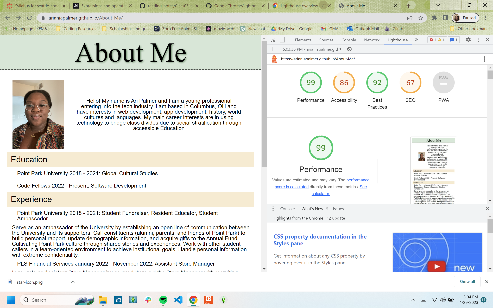

 Labs - 2, 3, 4 & 5

## About Me

I build an app that allow's the user to get to know the author, me. This app takes the user through a series of yes or no questions about me, as well as a number guessing game. At the end of the quiz and game, the user is presented a score of how many questions they answered correctly
### Author: Ariania Palmer

### Links and Resources

* [submission PR](http://xyz.com)
* Any Links you used as reference

### Lighthouse Accessibility Report Score

* Lab 2 Accessibility score

* Lab 3 Accessibility score
<!--  -->

### Reflections and Comments
